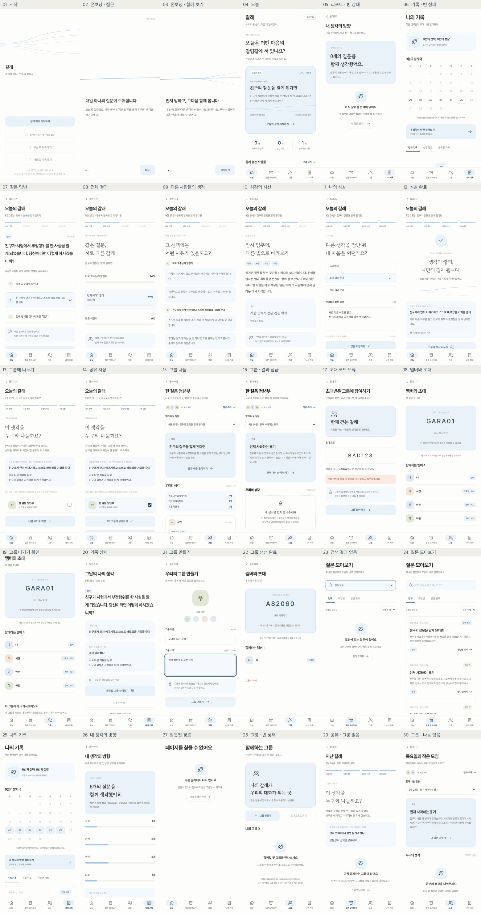

# 갈래

**하루에 하나, 오늘의 갈림길.**

갈래는 일상의 딜레마에 먼저 나의 선택을 남기고, 다른 사람들의 생각과 성경의 시선을 통해 자신의 판단을 돌아보는 서비스입니다. 기독교 대학생과 청년 공동체를 대상으로, 정답을 정하기보다 선택의 이유를 생각하고 나누는 경험을 지향합니다.

현재 저장소에는 **모바일 중심의 프론트엔드 데모**가 구현되어 있습니다. 로그인 없이 체험할 수 있으며, 답변과 그룹 정보는 사용 중인 브라우저에 저장됩니다.

## 사용 흐름

```text
오늘 또는 이전 질문 선택
  → 나의 선택 제출
  → 모두의 선택과 다른 사람들의 생각 확인
  → 성경의 시선으로 돌아보기
  → 나의 성찰 기록
  → 완료 후 원하는 그룹에 공유
```

아직 답하지 않은 질문의 결과와 그룹원 답변은 내 선택을 제출한 뒤에 열립니다. 그룹 가입만으로 내 답변이 공유되지는 않으며, 공유할 그룹을 직접 선택하고 저장해야 합니다.

## 주요 기능

| 영역 | 구현 내용 |
| --- | --- |
| 시작·온보딩 | 로그인 없이 시작하기, 서비스 안내 2장 |
| 오늘 | 오늘의 질문, 참여 요약, 가입 그룹, 최근 질문 |
| 질문 모아보기 | 이전 질문 답변, 검색, 답변 상태·주제 필터 |
| 답변·성찰 | 선택 제출, 예시 결과·의견, 해설, 반응, 성찰 작성·수정 |
| 그룹 | 그룹 생성, 초대 코드 참여, 멤버 조회, 코드 복사, 탈퇴 |
| 공유 | 내용 미리보기, 복수 그룹 선택, 공유 해제, 공유 대상 초안 보존 |
| 나의 기록 | 답변 달력, 기록 상세, 성찰·공유 상태 필터 |
| 내 생각의 방향 | 주제별 답변 개수와 성찰 후 생각이 바뀐 횟수 |

질문별 선택·성찰·공유 대상 초안은 탭 이동과 새로고침 후에도 유지됩니다. 제출한 선택은 읽기 전용으로 보존되며, 성찰은 다시 작성할 수 있습니다.

## 화면 미리보기

아이보리 배경에 파란색을 강조색으로 사용합니다. 버튼 배경은 `#EAF2F9`, 강조 글자는 `#2B4A63`입니다.

<details>
<summary>전체 화면 펼쳐보기</summary>



</details>

[전체 화면 이미지 열기](docs/SCREENS.jpg)

## 로컬 실행

Node.js 22.12 이상과 npm이 필요합니다. 현재 데모는 별도의 환경 변수나 API 키 없이 실행됩니다.

```sh
git clone https://github.com/jeondowon/galae.git
cd galae
npm ci
npm run dev
```

터미널에 표시된 로컬 주소로 접속합니다. 기본 주소는 `http://localhost:5173`이며, 포트가 사용 중이면 다른 포트로 실행됩니다.

### 명령어

| 명령어 | 설명 |
| --- | --- |
| `npm run dev` | 개발 서버 실행 |
| `npm test` | 상태 저장·복원 회귀 테스트 실행 |
| `npm run build` | `dist/`에 배포용 파일 생성 |
| `npm run preview` | 빌드 결과를 로컬에서 미리보기 |

빌드 결과를 확인하려면 `npm run build` 이후 `npm run preview`를 실행합니다.

## 데모 체험 안내

- 최초 방문 시 예시 그룹 **한 걸음 청년부**에 가입된 상태로 시작합니다.
- 그룹 탭에서 초대 코드 **`GARA26`**을 입력하면 **목요일의 작은 모임**에 참여할 수 있습니다.
- 총 6개의 질문이 있으며, 데모의 오늘은 **2026년 9월 25일**로 고정되어 있습니다.
- 참여 수, 선택 비율, 다른 사람의 의견과 그룹원 나눔은 예시 데이터입니다.
- 내 답변·성찰과 그에 따른 참여 개수는 실제로 입력한 내용을 반영합니다.

### 저장 방식과 구현 범위

데이터는 `localStorage`의 `garae.frontend.v1` 키에 저장됩니다. 브라우저나 접속 주소가 달라지면 저장 공간도 달라지며, 사이트 데이터를 삭제하면 기록이 사라집니다.

소셜 로그인, 서버 API, 실제 사용자 간 전송, 기기 간 동기화, 실시간 통계, AI 해설 생성은 아직 연결되어 있지 않습니다. 그룹 초대와 공유도 같은 브라우저 안에서 동작하는 체험용 기능입니다. 결과 잠금과 그룹별 표시 제한은 프론트엔드 동작이며, 서비스 운영 시 서버의 권한 검증이 필요합니다.

## 기술 구성

| 항목 | 사용 기술 |
| --- | --- |
| 화면 | React 19, JavaScript, JSX |
| 개발·빌드 | Vite 8 |
| 스타일 | CSS, Pretendard, 고운바탕 |
| 화면 이동 | URL 해시 기반 라우팅 |
| 상태 저장 | React 상태와 브라우저 `localStorage` |
| 자동 테스트 | Node.js 기본 테스트 러너 |

글꼴은 외부 CDN에서 불러오며, 연결할 수 없으면 기본 글꼴로 표시됩니다.

## 프로젝트 구조

```text
src/
  App.jsx          # 화면 이동과 앱 상태 연결
  components/      # 헤더, 하단 탭, 아이콘 등 공통 UI
  screens/         # 오늘, 질문, 성찰, 그룹, 기록 등 화면
  questionData.js  # 날짜별 질문과 그룹 예시 데이터
  data.js          # 공통 문구와 예시 콘텐츠
  store.js         # 상태 저장·복원, 답변 갱신, 그룹 탈퇴
  motifs.jsx       # 갈래 모티프와 브랜드 아이콘
  index.css        # 공통 스타일과 반응형 화면 구성
tests/
  store.test.js    # 질문별 초안, 공유, 탈퇴, 데이터 복원 테스트
docs/
  APP_FLOW.md      # 화면 목록과 사용자 흐름
  QA.md            # 검증 결과와 구현 범위
  SCREENS.jpg      # 전체 화면 미리보기
PLAN.md            # 서비스 기획과 향후 검토 사항
```

## 관련 문서

- [서비스 기획](PLAN.md)
- [화면과 사용자 흐름](docs/APP_FLOW.md)
- [검증 기록](docs/QA.md)

현재 화면·저장·공유 정책은 `docs/APP_FLOW.md`를 기준으로 합니다. `PLAN.md`에는 아직 구현하지 않은 서버·AI 기능의 기획도 포함되어 있습니다.
