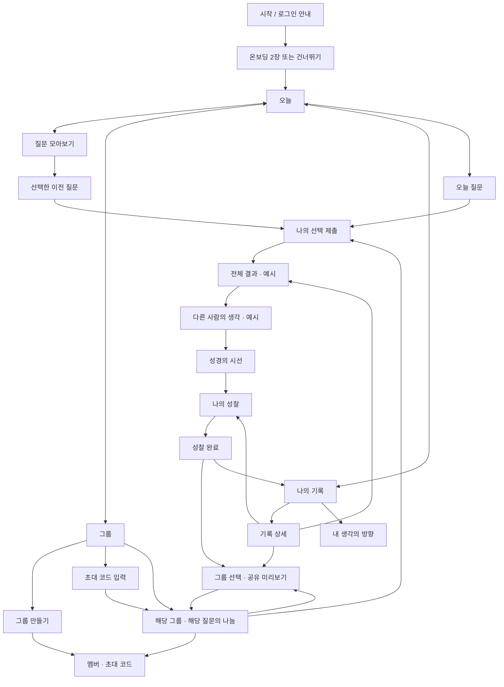

# 갈래 프론트엔드 화면과 사용자 흐름

작성일: 2026-09-25. 이번 요청에 따른 프론트엔드 구현 명세입니다. 이전 `PLAN.md`와 충돌하는 내비게이션·이전 질문 정책은 이 문서를 우선합니다.

2026-09-26: 전체 화면과 사용자 흐름 검증을 마쳤습니다. 공유 대상 초안 보존, 그룹 질문 선택의 주소 반영, 최초 진입 링크 유지, 작은 화면의 온보딩을 보완했습니다. 검증 내역은 [QA.md](QA.md), 화면 미리보기는 [SCREENS.jpg](SCREENS.jpg)를 확인하세요.

## 1. 이번 구현의 범위

- 모바일 중심 React 앱. 오늘, 질문 모아보기, 그룹, 나의 기록의 하단 탭 4개.
- 오늘 질문과 이전 질문을 동일한 흐름으로 답변. 과거 질문의 날짜 제한 없음.
- 질문별 선택·성찰·반응·공유 대상과 그룹 가입 상태를 브라우저에 저장.
- 그룹 생성, 초대 코드로 참여, 질문별 답변 나눔, 멤버 확인, 코드 복사, 그룹 나가기.
- 실제 인증·통계 집계·다른 사용자에게 전송·서버·백엔드 API는 구현하지 않음.
- 기존 10개 화면 파일은 모두 유지. 확인 없이 삭제한 화면 없음.

## 2. 전체 흐름



답변 중에도 하단 탭은 유지됩니다. 탭을 바꿔도 초안이 남으며, 브라우저 뒤로가기·앞으로가기와 새로고침으로 현재 화면을 다시 열 수 있습니다.

## 3. 화면 목록과 진입 경로

| 화면 | 경로 또는 진입 | 내용과 주요 행동 |
| --- | --- | --- |
| 시작 | 최초 방문 | 로그인 없이 미리 시작하기. 소셜 로그인은 준비 중으로 비활성 표시 |
| 온보딩 | 시작 버튼 | 오늘/이전 질문 안내, 선택 후 열람·그룹 공유 안내. 건너뛰기 |
| 오늘 | `#/today` | 오늘 질문, 내 참여 요약, 가입 그룹, 최근 질문 |
| 질문 모아보기 | `#/archive` | 검색, 미답변/완료 필터, 주제 필터, 질문 선택, 검색 결과 없음 |
| 질문 답변 | `#/question/:id/answer` | 선택지, 제출 전 결과 잠금, 제출 버튼 |
| 전체 결과 | `#/question/:id/result` | 질문별 분포, 내 선택 표시. 참여 수와 비율은 예시 |
| 다른 사람의 생각 | `#/question/:id/opinions` | 선택 이유 예시와 읽은 뒤의 반응 |
| 성경의 시선 | `#/question/:id/reading` | 해당 질문의 주제, 해설, 구절 또는 묵상 질문과 참조 |
| 나의 성찰 | `#/question/:id/reflect` | 변화 정도 필수 선택, 500자 이내 성찰 선택 입력, 저장 |
| 성찰 완료 | `#/question/:id/done` | 저장 내용, 공유, 기록, 다른 질문 이동 |
| 그룹에 나누기 | `#/question/:id/share` | 실제 공유될 내용 미리보기, 그룹 복수 선택, 공유 해제, 저장 결과 |
| 그룹 목록 | `#/groups` | 가입 그룹, 만들기, 초대 코드 참여, 그룹 없는 상태 |
| 그룹 만들기 | `#/groups/new` | 이름 20자, 소개 100자, 색상 선택. 생성 후 초대 화면 |
| 그룹 참여 | `#/groups/join` | 6자리 코드, 잘못된 코드/중복 가입 처리 |
| 그룹 상세 | `#/groups/:id` | 질문 선택, 선택별 공유 인원, 구성원 나눔, 잠금/빈 상태 |
| 특정 질문의 그룹 상세 | `#/groups/:id/:questionId` | 공유 후 해당 질문의 나눔으로 복귀 |
| 멤버와 초대 | `#/groups/:id/members` | 멤버 목록, 코드 복사, 그룹 나가기 확인 |
| 나의 기록 | `#/records` | 답변 수, 성찰 수, 실제 답변 상태를 반영한 달력, 상태 필터 |
| 기록 상세 | `#/records/:id` | 선택, 성찰, 공유 상태, 해설 다시 보기·성찰 수정·공유 관리 |
| 내 생각의 방향 | `#/report` | 실제 답한 질문의 주제별 개수, 변화가 있었던 성찰 개수 |
| 잘못된 경로 | 존재하지 않는 경로/탈퇴한 그룹 | 안내와 오늘로 돌아가기 |

## 4. 답변과 공유 규칙

1. 질문별 상태를 별도로 저장합니다. 오늘의 초안이 이전 질문에 나타나지 않습니다.
2. 선택하지 않으면 제출할 수 없습니다. 제출한 선택은 읽기 전용이며, 성찰은 다시 작성할 수 있습니다.
3. 직접 결과 경로를 입력하더라도 미제출 질문은 선택 화면이 열립니다. 그룹의 해당 질문 답변도 제출 후에 열립니다.
4. 다른 사람의 답변을 읽기 위해 자신의 답변을 공유할 필요는 없습니다.
5. 초기 공유 대상은 없습니다. 그룹 가입만으로 기존 답변이 공유되지 않습니다.
6. 공유 화면에서 **선택 + 성찰 문장**을 미리 보고 그룹을 선택해 저장합니다. 비선택 그룹에는 보이지 않습니다.
7. 공유 그룹을 해제하고 저장하면 해당 그룹의 내 게시물이 사라집니다. 개인 기록은 남습니다.
8. 초안과 성찰 입력은 자동 저장됩니다. 공유 중인 성찰을 수정하면 해당 그룹에 보이는 내용도 갱신됩니다.
9. 그룹 나가기는 화면 내 확인 단계가 있습니다. 개인 기록을 유지하고 그 그룹에 대한 공유만 해제합니다. 다른 그룹 공유에는 영향이 없습니다.
10. 성찰의 변화 정도를 선택하고 저장해야 완료 처리됩니다. 성찰을 마치지 않은 상태에서 완료 경로로 접근하면 성찰 화면이 열립니다.
11. 공유 대상 체크 상태도 질문별 초안으로 저장합니다. 탭 이동·새로고침 후 복원되지만, 공유 버튼을 누르기 전에는 그룹 게시물에 반영되지 않습니다. 탈퇴한 그룹은 초안에서도 제거합니다.
12. 그룹에서 질문을 바꾸면 주소도 바뀝니다. 새로고침·뒤로가기·앞으로가기로 선택한 질문을 복원합니다. 첫 방문 온보딩을 마친 뒤에도 원래 열었던 경로를 유지합니다.

## 5. 프론트엔드 데이터

- `src/questionData.js`: 6개의 날짜별 질문과 각 선택지·결과·의견·해설, 그룹·구성원·나눔 예시.
- `src/store.js`: 초기 상태, 저장 복원, 질문별 업데이트, 그룹 나가기 처리.
- `localStorage` 키: `garae.frontend.v1`.
- 저장 내용: 시작 여부, 질문 ID별 답변, 그룹 목록, 가입 그룹 ID.
- 새 방문자는 예시 그룹 ‘한 걸음 청년부’에 가입된 상태. 답변은 0개로 시작.
- 예시 참여 코드: `GARA26` → ‘목요일의 작은 모임’. 생성한 그룹에도 별도의 6자리 코드 부여.
- 데모의 오늘은 **2026-09-25**로 고정. 달력도 데모 질문이 있는 2026년 9월을 표시. 실제 일별 갱신 기능이 아님.
- 실제 통계인 것처럼 보이지 않도록 전체 참여 수·분포·의견과 그룹원 나눔에 예시 표시.
- 기존 가치관 점수 대신 현재 브라우저의 실제 답변으로 주제별 참여 개수를 표시. 성격 판정이나 가치관 점수를 추정하지 않음.
- 저장 불가 시 화면에 경고. 데이터를 지우거나 다른 브라우저를 사용하면 복원되지 않음.
- 그룹 초대 코드는 다른 기기에서 사용할 수 없음. 구성원·전송·권한 검증은 서버 연동 시 별도 구현 필요.

## 6. 여백과 디자인 개선

### 기존 문제

고정된 휴대폰 높이, 상하 64/40px 패딩과 `flex: 1` 빈 영역으로 짧은 화면에서는 넓은 공백이 생겼습니다. 홈 역할을 하는 화면이 없어 질문 완료 후 다음 행동도 부족했습니다. 기록·리포트 등 일부 경로의 복귀 수단도 부족했습니다.

### 적용한 방식

- 오늘 화면에 오늘 질문 → 개인 참여 요약 → 가입 그룹 → 이전 질문을 배치해 빈 공간을 유용한 진입점으로 전환.
- 답변·결과·해설은 내용 뒤에 다음 버튼을 이어 배치. 짧은 화면을 인위적으로 늘리지 않고 긴 화면은 본문 스크롤 사용.
- 하단 바가 차지하는 영역을 본문과 분리하고 모바일 안전 영역 반영.
- 헤더·진행 표시·카드·본문·보조 문구의 위계와 간격을 공통화.
- 아이보리 배경, 원래 기획의 파란색 강조 (`#2B4A63`, 버튼 배경 `#EAF2F9`), 기존 갈래 선 모티프와 명조 제목을 조합.
- 그룹은 이니셜과 색상으로 식별. 카드 장식보다 질문·나눔 내용에 집중.
- 검색 결과 없음, 참여 기록 없음, 그룹 없음, 공유 전/후, 결과 잠금 상태도 화면으로 제공.
- 320px부터 데스크톱 중앙 모바일 프레임까지 대응. 키보드 포커스, 선택 상태, 현재 탭, 폼 레이블, 모션 감소 설정 지원.

## 7. 삭제·통합 후보 — 확인 전 유지

실제 삭제한 화면은 없습니다. 아래 두 항목은 역할이 겹칠 수 있어 통합 후보로 보고합니다.

| 후보 | 제안 | 이점 | 남겨둘 이유 |
| --- | --- | --- | --- |
| `Opinions.jsx` 별도 화면 | `Result.jsx` 아래 ‘선택의 이유’ 섹션으로 통합 | 결과→의견 사이 이동 1회 감소, 결과 화면의 정보 밀도 개선 | 분포와 이유를 차례로 읽는 현재 리듬을 유지할 수 있음 |
| `Done.jsx` 별도 화면 | 성찰 저장 후 기록 상세와 공유 안내로 통합 | 완료 후 다시 기록으로 가는 이동 감소 | 하루 경험을 마쳤다는 정서적 마무리를 제공함 |

권고: **완료 화면은 유지**, 의견 화면의 결과 화면 통합 여부만 먼저 검토. 승인 전에는 파일과 진입 흐름을 모두 유지합니다. 시작·온보딩은 최초 진입과 안내에 필요하므로 삭제를 권하지 않습니다.

## 8. 검증과 실행

```sh
npm run dev -- --host 127.0.0.1
npm run build
node --test
```

자동 테스트(`npm test`로도 실행): 질문별 선택·초안 분리, 기본 비공개, 공유 대상 초안과 실제 공개 대상 분리, 그룹 탈퇴 시 해당 그룹 공유·초안 해제, 개인 기록 유지, 이전 저장 데이터 복원·손상 처리.

브라우저 검증 결과는 `docs/QA.md`에 기록합니다.

## 9. 서버 연동 이후의 경계

실제 소셜 인증, 사용자별 데이터, 그룹 초대 유효성·권한·탈퇴, 답변 공유 접근 제어, 실제 참여 통계, 날짜별 콘텐츠 공급은 서버에서 처리해야 합니다. 이 구현의 결과 잠금과 그룹 필터는 화면 동작용이며 보안 경계가 아닙니다. 실시간 채팅·알림·관리자 화면·프로필 설정 등 요청 밖 기능은 추가하지 않았습니다.
